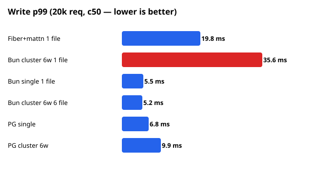
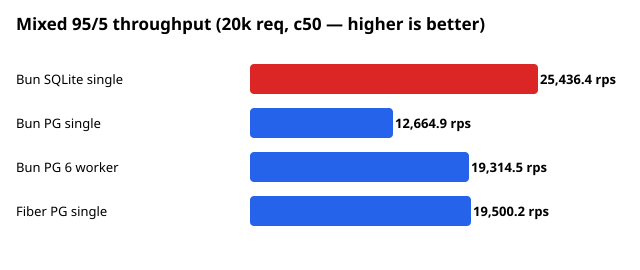
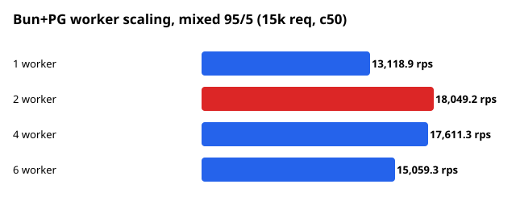

# SQLite vs Postgres: single vs cluster HTTP benchmark

Riset empiris: apakah `bun:sqlite` multi-proses (`reusePort`) mengalami degradasi
persentil yang sama dengan SQLite + Go Fiber saat stress test — dan arsitektur apa
yang tepat untuk aplikasi production read-heavy di single server.

> Bahasa: Indonesia. Semua angka = mean antar-iterasi (3–5 iterasi per sel),
> `fail=0` di semua run (raw data: [`data/`](data/), agregat: [`results/summary.json`](results/summary.json)).

## Ringkasan eksekutif

1. **Ya, Bun cluster mengalami hal serupa — bahkan tail write-nya lebih lebar.**
   Penyebabnya bukan goroutine, melainkan **satu WAL write-lock SQLite**:
   6 proses = 6 penantang berebut gembok yang sama lintas-proses (mahal),
   vs N goroutine antre di 1 pool (murah).
2. **Single event-loop = antrean single-writer gratis** → pola optimal untuk write SQLite
   (write p99 5.5ms vs 35.0ms cluster-1-file).
3. **reusePort obat pintu, bukan dapur**: besar efeknya kalau bottleneck di app
   (SQLite read +73%), nol/negatif kalau bottleneck di DB (PG c50 −10%).
4. **Sharding (1 worker 1 file)** mengembalikan scaling: write +86%, tail rata.
5. **Postgres tidak punya anomali tail** (MVCC): gap p99 maks ~1.5x, crossover cluster
   baru muncul di konkurensi tinggi (c150).
6. **Rekomendasi produksi** (read-heavy, single node, vertical-only):
   **SQLite, 1 proses writer, WAL + synchronous NORMAL + busy_timeout 5000.**
   Bun single atau Go Fiber+mattn (pilih sesuai kenyamanan tim).





## Metodologi

| Aspek | Nilai |
|---|---|
| Mesin uji | OVHcloud Singapore, plan VPS-3 (terukur: 6 vCPU, RAM 11,7 GB, Ubuntu) |
| Go 1.27.0, Fiber v2.52.9, mattn/go-sqlite3 v1.14.32 (CGo), pgx v5.11.0 | |
| Bun 1.4.0 (`bun:sqlite`, `Bun.SQL`), Postgres 18.6 | |
| Skema | `kv(id INTEGER PK AUTOINCREMENT, val TEXT 100B)`, seed 20.000 baris |
| SQLite PRAGMA | `journal_mode=WAL, synchronous=NORMAL, busy_timeout=5000, cache_size=-64MB` |
| Endpoint | `POST /write` (1 INSERT autocommit), `GET /read?id=` (point lookup) |
| Harness | [`bench/bench.js`](bench/bench.js) (murni) dan [`bench/mix.js`](bench/mix.js) (campuran 95/5), konkurensi tetap, lapor avg/p50/p95/p99/max + rps |
| Server | [`servers/`](servers/): `fiber.go` (Fiber+mattn, pool 10), `fiber-pg.go` (Fiber+pgx, pool 10), `bun-server.js` (single/cluster reusePort), `bun-shard.js` (1 worker 1 file), `pg-server.js` (Bun+PG single/cluster) |

## E1 — Go Fiber+mattn vs Bun cluster: write terdegradasi di tail (20k req, c50, 5 iterasi)

| | rps | p50 | p95 | p99 | max |
|---|---|---|---|---|---|
| READ Fiber | 46.300 | 0,92 | 2,25 | 4,06 | 15,1 |
| READ Bun 6-worker | 51.372 | 0,82 | 1,68 | 2,92 | 8,3 |
| WRITE Fiber | 14.635 | 2,25 | 9,24 | **19,84** | 192,1 |
| WRITE Bun 6-worker | 15.149 | 1,04 | 12,60 | **35,59** | 103,0 |

Range p99 write 5 ronde tidak overlap (Fiber 19,2–21,1 vs Bun 34,1–37,9;
gap ~15,7ms vs std ~1ms). Median Bun 2x lebih baik, tail ~1,8x lebih buruk —
distribusi bimodal: jalur sepi (6 acceptor) kilat, jalur tabrakan (lock + retry +
checkpoint) dalam.

## E2 — Bun single vs cluster, 1 file (3 iterasi)

| | rps | p50 | p95 | p99 | max |
|---|---|---|---|---|---|
| READ single | 27.568 | 1,66 | 3,12 | 4,51 | 10,4 |
| READ cluster | 47.865 | 0,92 | 1,92 | 3,51 | 9,0 |
| WRITE single | 20.411 | 2,23 | 3,97 | **5,49** | 13,6 |
| WRITE cluster | 15.557 | 0,73 | 12,67 | **34,95** | 145,7 |

Single +31% throughput write, p99 **6x lebih kecil**. reusePort +73% untuk read,
bencana untuk write 1-file.

## E3 — Cluster sharded: 1 worker 1 file (3 iterasi)

| WRITE | rps | p50 | p95 | p99 | max |
|---|---|---|---|---|---|
| Single 1 file | 21.044 | 2,20 | 3,77 | 5,06 | 14,4 |
| Cluster 6w 1 file | 15.557 | 0,73 | 12,67 | 34,95 | 145,7 |
| Cluster 6w 6 file | 39.082 | 1,07 | 2,63 | 5,19 | 15,4 |

Shard: +86% vs single, +151% vs cluster-1-file, tail rata kembali. Konfirmasi
bersih: yang merusak adalah **jumlah writer per file**, bukan reusePort-nya.
Syarat: data ikut terpecah (konsistensi lintas-shard jadi urusan aplikasi).

## E4 — Postgres single vs cluster, tabel bersama (3 iterasi c50 + 1 ronde c150)

| | c50 rps | c50 p99 | c150 rps | c150 p99 |
|---|---|---|---|---|
| READ single | 21.407 | 6,22 | 14.118 | 55,89 |
| READ cluster | 19.270 | 8,83 | 17.708 | 58,84 |
| WRITE single | 20.596 | 6,81 | 15.094 | 25,27 |
| WRITE cluster | 18.706 | 9,89 | 17.718 | 26,19 |

Tidak ada collapse (gap p99 ≤1,5x). Di c50 single sedikit menang
(bottleneck = ~2ms/query PG; 60 koneksi cluster cuma nambah overhead).
Di c150 cluster unggul (+25% read, +17% write) — crossover saat accept-queue jenuh.

## E5 — Beban campuran 95/5, 20k req c50 (2 iterasi): SQLite vs PG, Fiber vs Bun

| | rps | read p99 | write p99 |
|---|---|---|---|
| Bun SQLite single | 25.436 | 5,21 | 5,42 |
| Fiber PG single | 19.500 | 6,98 | 7,44 |
| Bun PG 6 worker | 19.314 | 10,51 | 13,39 |
| Bun PG single | 12.665 | 8,00 | 8,19 |

SQLite +30% throughput vs PG terbaik, tail paling rapi — 5% write tidak merusak
read. Di backend sama, Fiber single ≈ Bun 6-worker dan 55% di atas Bun single.

## E6 — Kurva scaling worker Bun+PG, mixed 95/5 (15k, c50)

| 1 worker | 2 worker | 4 worker | 6 worker |
|---|---|---|---|
| 13.119 rps, max 50ms | **18.049 rps**, max 59ms | 17.611 rps, max 104ms | 15.059 rps, max 210ms |

U-terbalik: sweet spot 2 worker; selebihnya oversubscribe PG + CPU.

## Rekomendasi produksi (read-heavy, single node, vertical-only)

1. **SQLite, tepat 1 proses writer.** Kelemahan SQLite (tak bisa scale-out) tidak
   relevan untuk vertical-only.
2. **Stack: Bun single atau Fiber+mattn** — pilih sesuai kenyamanan tim.
3. **Guardrail**: write batch dalam transaksi; `busy_timeout=5000`; monitor ukuran
   WAL + durasi checkpoint (sinyal saturasi write); sadari tradeoff
   `synchronous=NORMAL` (jendela kecil kehilangan data saat OS crash — jika tak
   acceptable, pakai FULL atau PG).
4. **Jalur migrasi ke PG** bila write >~20–30%, butuh failover, atau multi-node:
   Fiber single atau Bun 2-worker (bukan 6).

## Batas riset

Run hitungan detik (bukan jam: tanpa data WAL-growth jangka panjang,
checkpoint storm, fragmentasi); pool 10/worker arbitrer (belum di-sweep);
payload tunggal 100B; satu mesin 6-CPU; Fiber+SQLite mixed belum diuji.

## Reproduksi

```bash
# SQLite: Go Fiber (butuh gcc/CGo)
cd servers && go build -o fiber-server fiber.go
./fiber-server 4101 ./fiber.db
# SQLite: Bun cluster 6 worker reusePort
PORT=4102 WORKERS=6 bun bun-server.js
# Bench
bun ../bench/bench.js http://127.0.0.1:4101/write 20000 50 write
bun ../bench/mix.js http://127.0.0.1:4102 20000 50 5
```
